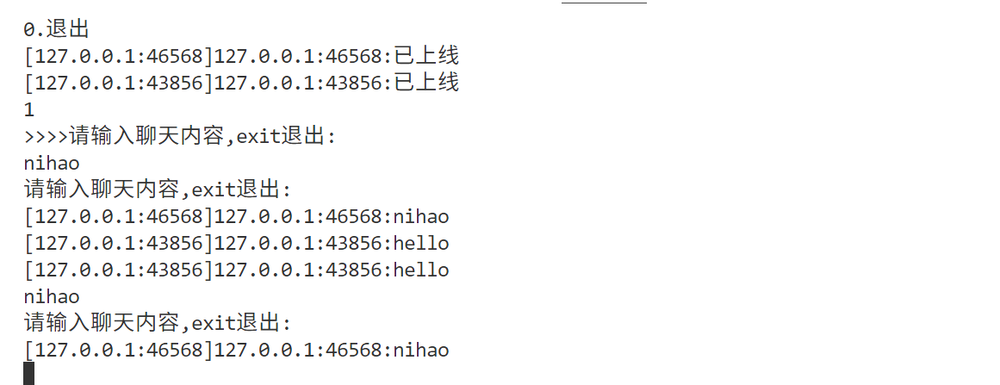
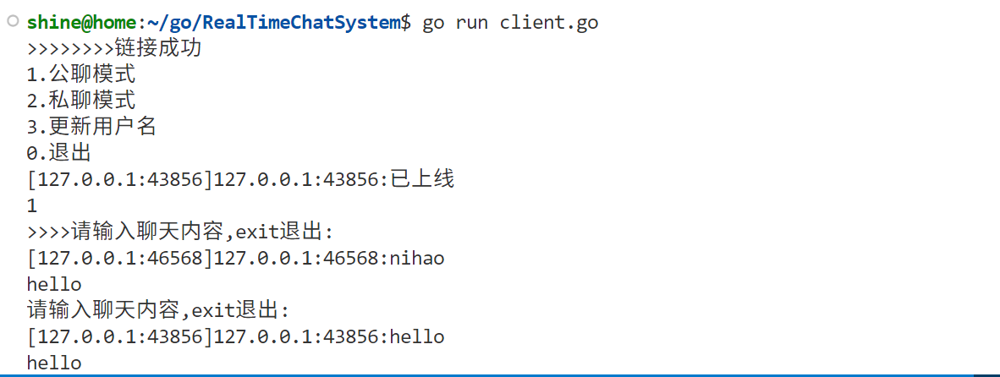

# RealTimeChatSystem

这是一个基于 Go 语言实现的实时聊天系统。

## 功能

- 用户上线和下线通知
- 公聊模式：所有在线用户可以接收和发送消息。
- 私聊模式：用户可以选择特定在线用户进行一对一聊天。
- 修改用户名：用户可以修改自己的显示名称。
- 查询在线用户：用户可以查看当前所有在线的用户列表。
- 超时处理：用户长时间无操作将被服务器踢下线。

## 功能演示

### start server


### client chat




## 项目结构

```
.
├── client
├── client.go     # 客户端主程序
└── serverp/
    └── user.go       # 用户相关逻辑
    ├── main.go       # 服务器主程序入口
    ├── server
    ├── server.go     # 服务器核心逻辑
```

## 如何运行

### 服务器

```bash
./server
```

### 客户端

```bash
./client
```

或者带参数运行：

```bash
./client -Ip <服务器IP地址> -Port <服务器端口号>
```

默认连接到 `127.0.0.1:8888`。

## 使用说明

客户端启动后，会显示以下菜单：

```
1.公聊模式
2.私聊模式
3.更新用户名
0.退出
```

根据提示输入数字选择相应功能。

- **公聊模式**: 输入消息后按回车发送，所有在线用户可见。输入 `exit` 退出公聊模式。
- **私聊模式**:
  1. 首先会显示当前在线用户列表。
  2. 输入目标用户的名称。
  3. 输入要发送的消息。
  4. 输入 `exit` 退出当前私聊对象或返回主菜单。
- **更新用户名**: 输入新的用户名即可。
- **退出**: 关闭客户端。

## 注意事项

- 服务器默认监听 `127.0.0.1:8888`。
- 客户端和服务端需要在同一网络环境下，或者客户端能够访问到服务端运行的 IP 和端口。
